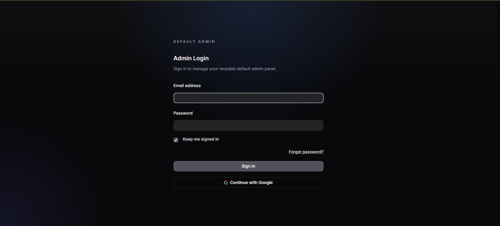
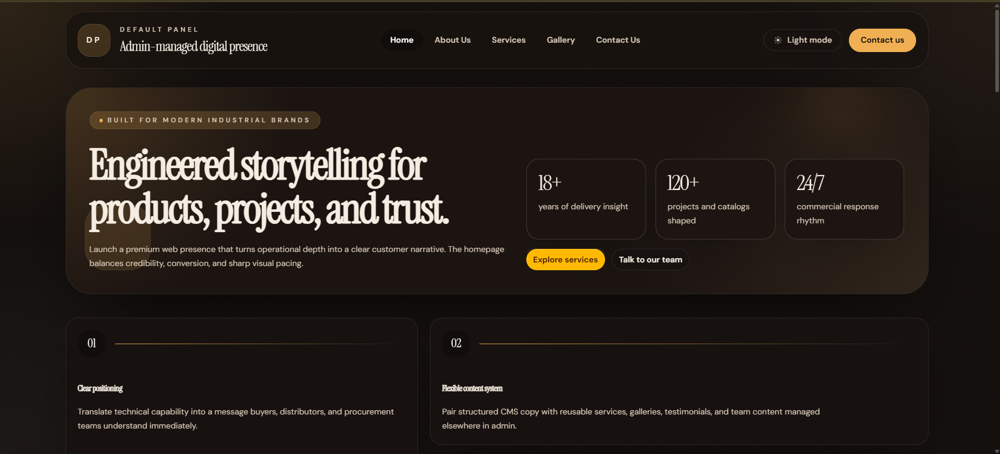
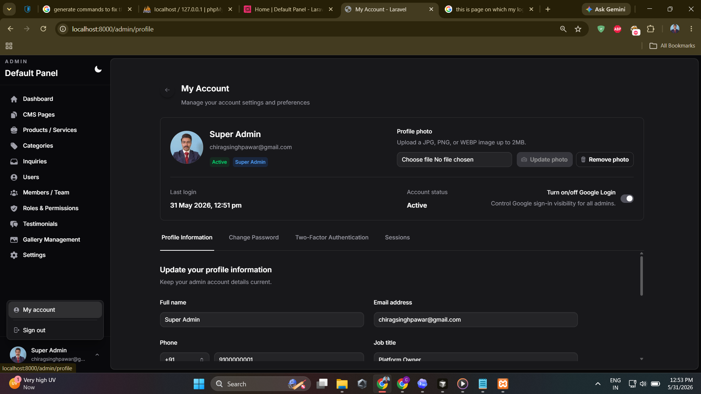
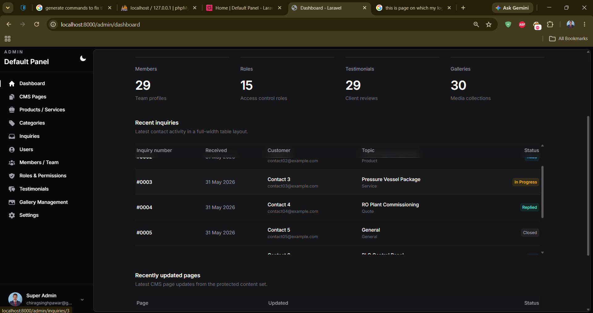
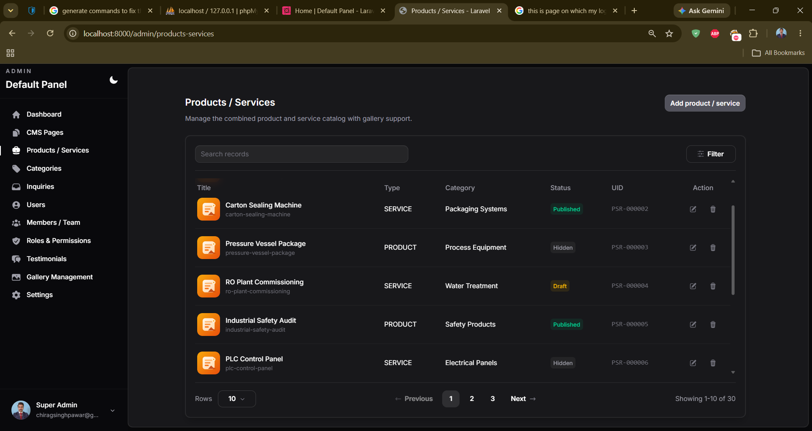
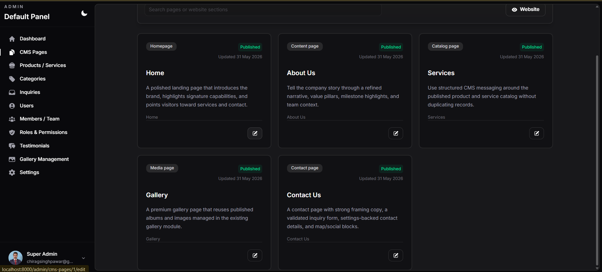
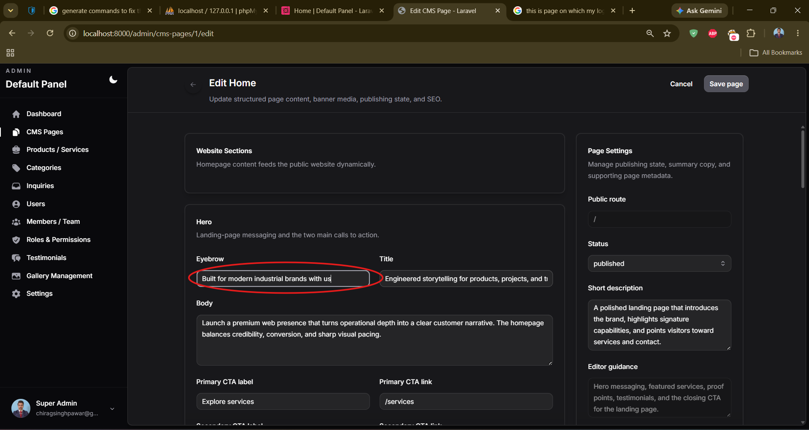
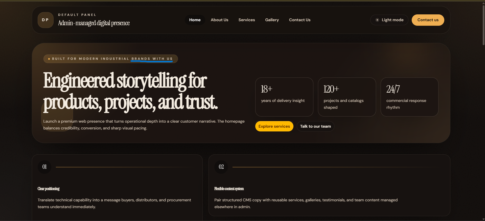

# Default Panel CMS Admin

Default Panel CMS Admin is a full-stack Laravel and React content management system for managing a public business website from a secured admin panel. The project includes a public CMS-driven website, an admin dashboard, role-based access control, inquiry handling, catalog management, gallery management, public theme switching, maintenance mode, Google login support, and two-factor admin security.

The public website is designed for a company-style digital presence with Home, About Us, Services, Gallery, and Contact Us pages. The admin panel controls the reusable content, catalog data, team records, testimonials, galleries, contact settings, and publishing states that appear on the public site.

## Table of Contents

1. [Project Highlights](#project-highlights)
2. [Technology Stack](#technology-stack)
3. [Screenshots](#screenshots)
4. [Demo Super Admin Login](#demo-super-admin-login)
5. [Feature Overview](#feature-overview)
6. [How the CMS Works](#how-the-cms-works)
7. [Admin Workflow](#admin-workflow)
8. [Public Website Pages](#public-website-pages)
9. [Local Setup](#local-setup)
10. [Environment Configuration](#environment-configuration)
11. [Database Seed Data](#database-seed-data)
12. [Project Structure](#project-structure)
13. [GitHub Upload Checklist](#github-upload-checklist)
14. [Deployment Notes](#deployment-notes)

## Project Highlights

- Public website content is managed through fixed CMS page records instead of hardcoded static copy.
- Admin users are protected by a dedicated `admin` guard, roles, permissions, profile security, and optional two-factor authentication.
- Products and services are managed as reusable catalog records and automatically power the public Services page.
- Contact form submissions are validated, throttled, stored as inquiries, and managed from the admin panel.
- Site settings control branding, logos, contact details, WhatsApp, map, social links, maintenance mode, and Google login visibility.
- Light and dark themes are supported for both the admin panel and public website.

## Technology Stack

| Layer | Technology |
| --- | --- |
| Backend | Laravel, PHP 8.3+, Inertia Laravel |
| Frontend | React 18, TypeScript, Inertia React, Vite, Tailwind CSS 4 |
| Authentication | Laravel session auth, dedicated admin guard, password reset, Google OAuth via Socialite |
| Authorization | Spatie Laravel Permission with roles and module permissions |
| Database | SQLite by default, compatible with MySQL/PostgreSQL through Laravel configuration |
| UI | Tailwind CSS, Headless UI, Heroicons, Motion |
| Storage | Laravel filesystem disks with public/private media handling |
| Security | CSRF protection, validation requests, throttled public inquiries, hidden sensitive admin fields |

## Screenshots

| Screen | Preview |
| --- | --- |
| Admin login |  |
| Public homepage in dark mode |  |
| Admin profile and security settings |  |
| Admin dashboard with recent inquiries |  |
| Products and services manager |  |
| CMS pages overview |  |
| CMS page editor |  |
| Public homepage with edited CMS content |  |

## Demo Super Admin Login

The seeded super admin account is defined in [database/seeders/AdminSeeder.php](database/seeders/AdminSeeder.php).

| Field | Value |
| --- | --- |
| Admin URL | `/admin/login` |
| Email | `admin@example.com` |
| Password | `password` |
| Role | `Super Admin` |
| Status | `active` |

Change this password before using the project outside local demo or portfolio review environments.

## Feature Overview

- Dashboard: Shows CMS, catalog, team, roles, testimonial, gallery, and inquiry activity in one admin view.
- CMS Pages: Manages fixed public pages, section copy, banner media, status, route metadata, and SEO fields.
- Products / Services: Manages product and service records with category, type, status, featured image, gallery images, features, benefits, specifications, and SEO.
- Categories: Groups products and services for public catalog browsing and admin organization.
- Inquiries: Stores public contact form submissions and supports admin status and note handling.
- Admin Users: Creates and manages admin accounts, status, roles, profiles, avatars, and access levels.
- Roles & Permissions: Controls access by module and action through Spatie-powered role permissions.
- Members / Team: Manages active team profiles displayed on public Home and About pages.
- Testimonials: Manages published client reviews displayed across public credibility sections.
- Gallery Management: Manages public albums, cover images, album details, and active gallery images.
- Settings: Controls company details, branding, logos, maintenance mode, Google login, WhatsApp, map, social links, and contact information.
- Public Theme Toggle: Allows public visitors to switch between light and dark public website themes.
- Admin Theme Preference: Allows admins to store their preferred admin panel theme.
- Google Login: Allows admins to sign in with Google when enabled and configured.
- Password Reset: Supports admin password reset flows through Laravel password brokers.
- Two-Factor Authentication: Supports email-based and authenticator-app-based admin two-factor flows.
- Media Storage: Stores admin-uploaded logos, avatars, banners, gallery images, and brochure assets through Laravel storage.
- Maintenance Mode: Lets admins temporarily disable public pages while keeping admin access available.

## How the CMS Works

1. Fixed CMS pages are registered in [app/Support/FixedCmsPageRegistry.php](app/Support/FixedCmsPageRegistry.php).
2. [database/seeders/CmsPageSeeder.php](database/seeders/CmsPageSeeder.php) creates the five protected page records: Home, About Us, Services, Gallery, and Contact Us.
3. Admins edit those pages from `Admin > CMS Pages`.
4. Each CMS page stores reusable content in `sections_json`, plus page title, slug, banner image, short description, status, meta title, meta description, and meta keywords.
5. Public routes in [routes/web.php](routes/web.php) load the matching page through `PublicSiteController`.
6. `PublicSiteController` combines CMS page content with published records from products/services, categories, members, testimonials, galleries, inquiries, and site settings.
7. Public React pages in [resources/js/Pages/public](resources/js/Pages/public) render the content using shared public layout components.
8. Updating a page in admin immediately changes the public website after the page is saved.

### CMS Page Responsibilities

| CMS Page | Admin-controlled content | Dynamic records used |
| --- | --- | --- |
| Home | Hero copy, CTAs, stats, reason blocks, featured section copy, testimonial framing, final CTA, SEO | Featured products/services, testimonials, members |
| About Us | Hero copy, story, values, milestones, team framing, testimonial framing, CTA, SEO | Members, testimonials |
| Services | Hero copy, intro copy, category framing, listing framing, CTA, SEO | Published products/services and active categories |
| Gallery | Hero copy, intro copy, album framing, CTA, SEO | Published galleries and active gallery images |
| Contact Us | Hero copy, form copy, success message, direct channel framing, CTA, SEO | Site settings, product/service options, inquiry types |

### CMS Content Management Flow

1. Sign in at `/admin/login`.
2. Open `CMS Pages` from the admin sidebar.
3. Select a fixed page such as Home, Services, or Contact Us.
4. Edit section fields such as eyebrow, title, body, CTA labels, CTA links, values, milestones, or form copy.
5. Upload or replace the page banner image when needed.
6. Update the short description and SEO metadata.
7. Set the page status to `published`, `draft`, or `hidden`.
8. Save the page.
9. Visit the public route to see the updated content.

## Admin Workflow

1. Login: Use the seeded super admin account or any seeded active admin account.
2. Dashboard: Review record counts, recent inquiries, and recently updated CMS pages.
3. CMS Pages: Update public page structure, messaging, media, status, and SEO.
4. Categories: Create and reorder service/catalog groupings.
5. Products / Services: Create product and service records that feed Home and Services.
6. Members / Team: Add active team profiles for public trust sections.
7. Testimonials: Publish client reviews used on Home and About.
8. Gallery Management: Create albums and attach images for the public Gallery page.
9. Inquiries: Review public form submissions, update workflow status, and add admin notes.
10. Users: Add or deactivate admin users and assign roles.
11. Roles & Permissions: Create roles and control module-level actions.
12. Settings: Update brand identity, contact details, maintenance mode, social links, map, WhatsApp, and Google login settings.
13. Profile: Update profile information, password, avatar, theme preference and sessions.
14. 2FA : Two-factor settings with OTP and Authenticator App also.

## Public Website Pages

- `/`: CMS-managed homepage with hero content, statistics, reasons, featured offerings, testimonials, team signal, and CTA.
- `/about-us`: CMS-managed company story page with values, milestones, team members, testimonials, and CTA.
- `/services`: CMS-managed catalog page backed by published products/services and active categories.
- `/gallery`: CMS-managed gallery page backed by published galleries and active gallery images.
- `/contact-us`: CMS-managed contact page with validated inquiry form, contact details, map, WhatsApp, and social links.
- `/media/{path}` and `/storage/{path}`: Controlled media access routes for stored assets.

## Local Setup

### Requirements

- PHP 8.3 or newer
- Composer
- Node.js and npm
- SQLite, MySQL, or PostgreSQL
- Git

### Installation Steps

1. Clone the repository.

```bash
git clone <repository-url>
cd Admin-Default-main
```

2. Install PHP dependencies.

```bash
composer install
```

3. Install frontend dependencies.

```bash
npm install
```

4. Create the environment file.

```bash
cp .env.example .env
```

On Windows PowerShell:

```powershell
Copy-Item .env.example .env
```

5. Generate the application key.

```bash
php artisan key:generate
```

6. Create the SQLite database file if you are using the default SQLite setup.

```bash
touch database/database.sqlite
```

On Windows PowerShell:

```powershell
New-Item -ItemType File -Path database/database.sqlite -Force
```

7. Run migrations and seeders.

```bash
php artisan migrate --seed
```

8. Create the public storage link.

```bash
php artisan storage:link
```

9. Build frontend assets for normal Laravel serving.

```bash
npm run build
```

10. Start the Laravel application.

```bash
php artisan serve
```

11. Open the application.

```text
Public website: http://127.0.0.1:8000
Admin login:    http://127.0.0.1:8000/admin/login
```

## Environment Configuration

Use [.env.example](.env.example) as the safe template for local setup.

Important environment values:

- `APP_NAME`: Application name shown by Laravel.
- `APP_URL`: Base URL used for links, storage URLs, and OAuth redirects.
- `APP_KEY`: Generated application encryption key.
- `APP_DEBUG`: Keep `true` locally and `false` in production.
- `DB_CONNECTION`: Defaults to SQLite for simple local setup.
- `MAIL_MAILER`: Defaults to `log` so password reset and two-factor emails are written to logs locally.
- `GOOGLE_CLIENT_ID`: Google OAuth client ID for admin Google login.
- `GOOGLE_CLIENT_SECRET`: Google OAuth client secret for admin Google login.
- `GOOGLE_REDIRECT_URI`: Google OAuth callback URL, usually `/admin/login/google/callback`.
- `FILESYSTEM_DISK`: Default storage disk.

Never commit a real `.env` file or production secrets.

## Database Seed Data

The main database seed flow is defined in [database/seeders/DatabaseSeeder.php](database/seeders/DatabaseSeeder.php).

Seeders included:

- `RolePermissionSeeder`: Creates admin roles and module permissions.
- `AdminSeeder`: Creates the super admin plus additional seeded admin accounts.
- `CmsPageSeeder`: Creates the fixed CMS page records.
- `SiteSettingSeeder`: Creates company, contact, social, map, WhatsApp, maintenance, and Google login settings.
- `CategorySeeder`: Creates service/catalog categories.
- `ProductServiceSeeder`: Creates seeded product and service catalog records.
- `InquirySeeder`: Creates seeded inquiry workflow records.
- `MemberSeeder`: Creates seeded team member profiles.
- `TestimonialSeeder`: Creates seeded client testimonials.
- `GallerySeeder`: Creates seeded gallery albums.
- `GalleryImageSeeder`: Creates seeded gallery images.
- `MediaSeeder`: Creates seeded media library records.

## Project Structure

```text
app/
  Http/Controllers/Admin/     Admin panel controllers
  Http/Controllers/           Public site and media controllers
  Http/Requests/Admin/        Admin validation request classes
  Models/                     Eloquent models for CMS, admin, catalog, inquiry, gallery, and settings data
  Support/                    CMS registry, page service, UI cache, theme, and media helpers

database/
  migrations/                 Schema for admins, roles, permissions, CMS pages, catalog, inquiries, settings, and media
  seeders/                    Demo data and protected CMS page seeders

resources/
  css/app.css                 Tailwind and shared theme variables
  js/Layouts/                 Admin, public, guest, and authenticated layouts
  js/Pages/admin/             Admin panel Inertia pages
  js/Pages/public/            Public website Inertia pages
  js/Components/              Shared UI, phone, and public page components

routes/
  web.php                     Public routes, admin auth routes, and protected admin module routes

screenshots/
  *.png                       GitHub README screenshots
```

## GitHub Upload Checklist

1. Keep `.env` out of Git.
2. Commit `.env.example` as the safe environment template.
3. Commit `composer.lock` and `package-lock.json` for reproducible installs.
4. Do not commit `vendor/`, `node_modules/`, `public/build/`, `public/storage/`, local SQLite files, logs, caches, or uploaded storage files.
5. Keep the `screenshots/` folder committed because the README uses those images.
6. Remove local archives such as `.zip` files before publishing.
7. Change seeded demo credentials before deploying anywhere public.
8. Add a project license file if this repository will be open sourced.

## Deployment Notes

- Set `APP_ENV=production`, `APP_DEBUG=false`, and a real `APP_KEY`.
- Configure a production database instead of the local SQLite file.
- Run migrations with seeders only when demo data is desired.
- Configure a real mail driver before using password reset or email two-factor authentication in production.
- Configure Google OAuth credentials only if Google admin login should be enabled.
- Ensure `storage/` and `bootstrap/cache/` are writable by the web server.
- Run `php artisan storage:link` so uploaded public assets can be served.
- Build frontend assets before serving the production application.
- Review roles and permissions before inviting non-super-admin users.

## License

This project currently does not include a dedicated license file. Add one before publishing if public reuse is intended.
